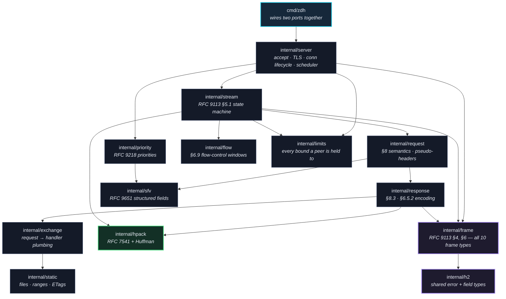
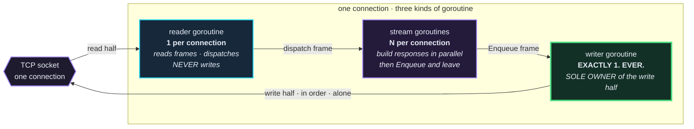
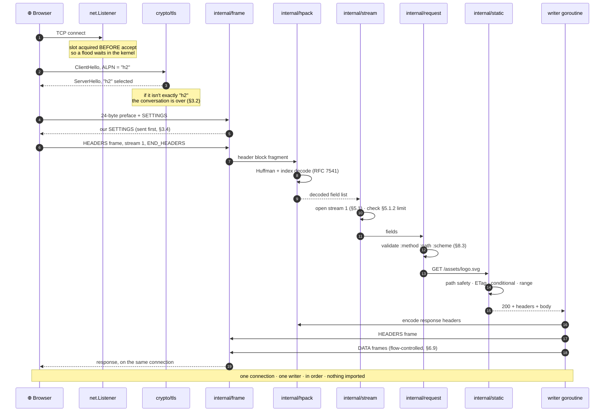
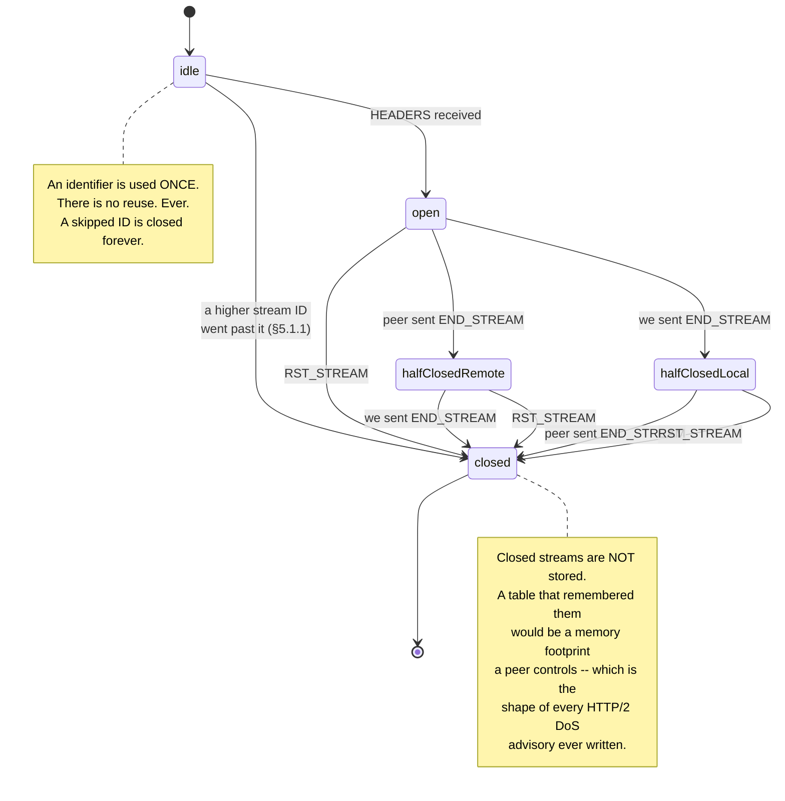
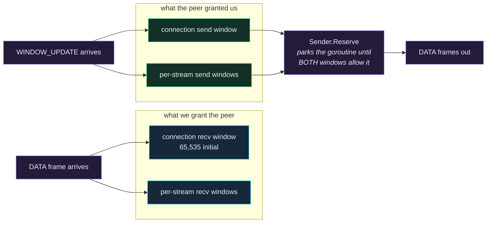
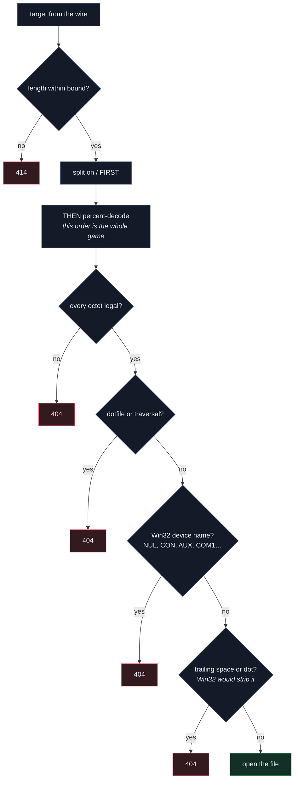
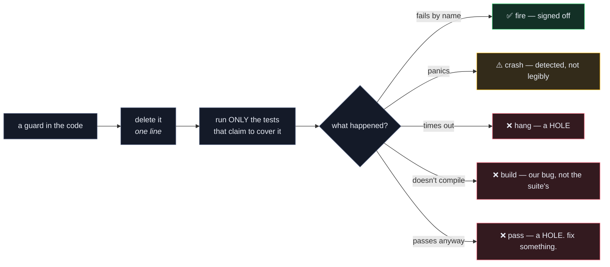

<div align="center">

# `zdh`

### An HTTP/2 server written against the Go standard library. And nothing else. Ever.

[](#-act-i--we-deleted-the-working-one-on-purpose)
[](docs/H2SPEC.md)
[](#-act-viii--we-broke-our-own-code-1218-times-on-purpose)
[](#-the-status-board)
[](#-why-not-nethttp)

**[▶ LIVE DEMO](https://zdh-hack-demo.duckdns.org/)** · **[h2spec transcript](docs/H2SPEC.md)** · **[HPACK notes](docs/HPACK.md)** · **[stdlib log](STDLIB.md)**

*Zero Dependency Hackathon 2026 · Track C (Web &amp; Network) · 72 hours · two people · no regrets, several regrets*

</div>

> Go ships a perfectly excellent HTTP/2 implementation. Battle-tested. Maintained
> by people with actual credentials. Free. Right there. `import "net/http"`. Done
> in one line.
>
> We looked at it and said **"no thank you."**

---

## 🎬 The 30-second version

You are about to read the README of a project that reimplemented HTTP/2 — frames,
streams, flow control, HPACK, Huffman coding, TLS with ALPN, conditional
requests, byte ranges, extensible priorities — **by hand, from the RFCs, in 72
hours**, while refusing to import a single line of code that wasn't in the Go
standard library.

| | |
|---|---|
| **What it is** | A real HTTP/2 server. Serves a directory. Speaks h2 over TLS and h2c by prior knowledge. |
| **Dependencies** | `0`. Not "few". Not "vendored". Zero. `go.sum` **does not exist**. |
| **Does it import `net/http`?** | No, and the build **physically refuses to compile** if it ever does. |
| **Conformance** | **147/147** on `h2spec --strict`. Somebody else's test suite, not ours. |
| **Tests** | **1,186** top-level tests, **7** fuzz targets. |
| **Guards proven to fire** | **1,218**, across 18 campaigns that delete our own safety checks on purpose. |
| **RFCs implemented** | 9113, 7541, 9110, 9218, 9651, 3986. We have read them. Repeatedly. Involuntarily. |
| **Lines of somebody else's code** | `0` |

```bash
git clone https://github.com/choksi2212/zerodeps-hackk && cd zerodeps-hackk
bash scripts/gate.sh     # 10 checks. all of them. no mercy.
bash scripts/build.sh    # -> bin/zdh
bin/zdh -dir public      # https://localhost:8443/  and  http://localhost:8081/
```

---

## 🔪 Act I — We deleted the working one on purpose

The rules said **zero third-party dependencies**. We read that as a *dare*.

Then we went further and banned `net/http` from our own project, which the rules
never asked for. Because using Go's HTTP/2 implementation to enter a
"write it yourself" competition is like bringing a forklift to a deadlift
contest. Technically you moved the weight.

So the entire dependency graph of this server is: `net`, `crypto/tls`, `bufio`,
`encoding/binary`, `os`, `time`, and friends. That's it. Every frame you receive
from this server was encoded by a function in this repository.

### The receipts, in four commands

```bash
cat go.mod                              # 2 non-blank lines. lists nothing.
ls go.sum                               # No such file or directory. good.
go list -m all                          # one line: this module
go version -m bin/zdh | grep -c dep     # 0
./bin/zdh -version                      # ...dependencies: 0
```

That last one is the good one. `zdh -version` reports **its own dependency count,
read out of its own embedded build info** — so the claim is verifiable from the
binary you run, not from a file we wrote and could have lied in. The full
regenerable evidence is committed as [`deps-proof.txt`](deps-proof.txt).

> **On the badges at the top of this file:** yes, those are fetched from
> shields.io, and they are the only third-party thing anywhere near this
> repository. They are images in a markdown file. They are not compiled into
> anything. Please put the pitchfork down.

---

## 🗺️ Act II — System design

Every box below is a Go package **in this repository**. Every arrow is an import.
The arrows only point one way, which is the entire discipline: **`internal/frame`
has never heard of a request, and never will.**



<table>
<tr><th align="left">Package</th><th align="left">What it owns</th><th align="left">Spec</th><th align="right">Tests</th></tr>
<tr><td><code>internal/frame</code></td><td>All 10 frame types, reader, writer, padding, CONTINUATION</td><td>RFC 9113 §4, §6</td><td align="right">211 + 5 fuzz</td></tr>
<tr><td><code>internal/hpack</code></td><td>Integers, string literals, static + dynamic table</td><td>RFC 7541</td><td align="right">37 + 1 fuzz</td></tr>
<tr><td><code>internal/huffman</code></td><td>The canonical Huffman code, hand-built tables</td><td>RFC 7541 App. B</td><td align="right">10</td></tr>
<tr><td><code>internal/stream</code></td><td>Stream state machine, identifiers, concurrency, reassembly</td><td>§5.1, §5.1.1, §5.1.2</td><td align="right">124</td></tr>
<tr><td><code>internal/flow</code></td><td>Both flow-control windows, and the sender that waits on them</td><td>§6.9, §6.9.2</td><td align="right">60</td></tr>
<tr><td><code>internal/server</code></td><td>Accept loop, TLS/ALPN, connection lifecycle, write scheduler</td><td>§3.4, §9.2, §6.8</td><td align="right">211</td></tr>
<tr><td><code>internal/request</code></td><td>Pseudo-headers, field validity, malformed-message rules</td><td>§8.1–§8.3</td><td align="right">76</td></tr>
<tr><td><code>internal/response</code></td><td>Status, header encoding, body writer, frame splitting</td><td>§8.3.2, §6.5.2</td><td align="right">61</td></tr>
<tr><td><code>internal/exchange</code></td><td>Handing a decoded request to a handler goroutine</td><td>—</td><td align="right">67</td></tr>
<tr><td><code>internal/static</code></td><td>Conditional requests, byte ranges, strong ETags, path safety</td><td>RFC 9110 §13, §14, §8.8.3</td><td align="right">153</td></tr>
<tr><td><code>internal/priority</code></td><td>Extensible priorities: urgency, incremental, PRIORITY_UPDATE</td><td>RFC 9218</td><td align="right">31 + 1 fuzz</td></tr>
<tr><td><code>internal/sfv</code></td><td>Structured field values — <b>replaces a third-party library</b></td><td>RFC 9651</td><td align="right">30 + 1 fuzz</td></tr>
<tr><td><code>internal/certgen</code></td><td>Self-signed certificate generation on first run</td><td>—</td><td align="right">46</td></tr>
<tr><td><code>internal/limits</code></td><td>Every bound and deadline a peer is held to</td><td>CVE-informed</td><td align="right">37</td></tr>
</table>

---

## 🎛️ Act III — Control architecture

Here is the single most important fact about this server, and it is a fact about
*permission*, not about code:

> **Exactly one goroutine per connection is allowed to touch the socket's write half.**

If two goroutines write frames to one socket, their bytes interleave. The peer
reads a 9-byte header, takes the next N bytes as payload, and **every frame after
that point is read at the wrong offset until the connection dies.** There is no
recovery. There is no resync. The connection is simply cursed now.

So we made it structurally impossible rather than carefully avoided.



**Why this shape:**

- The **reader** is also the goroutine that answers PINGs and notices GOAWAY, so
  nothing it calls is allowed to block indefinitely.
- **Stream goroutines** never see the socket. They get a `FrameEnqueuer` — a
  one-method interface — and that is the entire extent of their power.
- The **writer** coalesces frames into single writes, because over TLS every
  `Write` becomes at least one record with its own header and authentication tag.
- The **write scheduler** lives beside the writer and orders frames by RFC 9218
  urgency, so a stylesheet doesn't queue behind a 40 MB video.

### The six deadlines, and why each exists

| Deadline | Default | Stops |
|---|---|---|
| `TLSHandshake` | 10s | A peer that connects and says nothing, holding a connection slot for free |
| `Preface` | 10s | A peer that completes TLS then never sends the §3.4 preface |
| `Idle` | 60s | A connection nobody is using but nobody closed |
| `Write` | 10s | A peer that stops reading, wedging our writer forever |
| `SettingsAck` | 10s | A peer that never acknowledges our SETTINGS (§6.5.3) |
| `ShutdownGrace` | 5s | A graceful shutdown becoming an indefinite hang |

### The bounds a peer is held to

| Bound | Value | Because |
|---|---|---|
| `MaxFrameSize` | 16 KiB | §6.5.2's floor. Bigger frames are a memory lever for a peer. |
| `MaxHeaderBlockSize` | 128 KiB | A header block is peer-controlled and reassembled in memory. |
| `MaxContinuationFrames` | 32 | **CVE-2023-45288** — the CONTINUATION flood. |
| `MaxConcurrentStreams` | 100 | §5.1.2. One connection cannot be a thousand requests. |
| `MaxConns` | 512 | Descriptors are finite and so is our patience. |
| `ResetBurst` / refill | 100 / 20/s | **CVE-2023-44487** — HTTP/2 rapid reset. |

---

## 🌊 Act IV — Data flow: one request, all the way there and back

This is what happens when you ask this server for a file. Every participant is a
package in this repository. Every citation is a real sentence in a real RFC that
we have read more times than is medically advisable.



**Want to watch this happen for real?** The [live demo](https://zdh-hack-demo.duckdns.org/)
fires an actual request and walks a packet through all twelve of these stations,
then prints the *actual measured timings* from your browser's own network stack
underneath. The animation is a dramatization. The numbers are not.

---

## 🔁 Act V — The stream state machine

RFC 9113 §5.1, implemented literally. Note what is **missing**: there are no
`reserved` states, because this server does not push, so those states are
*absent* rather than present-and-unreachable. An unreachable state is a branch no
test can cover and every reader has to reason about anyway.



---

## 🚦 Act VI — Flow control and priorities

**Flow control** is HTTP/2's way of saying *"you may not send me more than I said
you could."* There are two windows — one for the connection, one per stream — and
a sender must respect both. Negative windows are **legal** (a shrinking
`SETTINGS_INITIAL_WINDOW_SIZE` applies as a delta to every open stream, §6.9.2),
which is the kind of sentence that costs you an afternoon.



**Priorities (RFC 9218)** are the part almost nobody implements. RFC 9113 §5.3
*deprecated* HTTP/2's original priority tree, and RFC 9218 replaced it with a
much simpler scheme: an urgency `0`–`7` and an `incremental` flag, carried either
as a `Priority` request header field or as a `PRIORITY_UPDATE` frame.

We implement **both carriers**, we buffer signals that arrive for streams that
don't exist yet (§7 asks servers to), we bound that buffer by
`SETTINGS_MAX_CONCURRENT_STREAMS` (§7.1), and we advertise
`SETTINGS_NO_RFC7540_PRIORITIES: 1` because §2.1.1 says a client that doesn't see
it *should stop sending the frames we just implemented.*

Parsing those header fields correctly requires RFC 9651 structured field values,
so we wrote **`internal/sfv`** — a complete Dictionary parser for all eight item
types — which is why this entry claims the **Package Killer** bonus. It replaces
the third-party `httpsfv`.

---

## 🛡️ Act VII — The bouncer

A file server that serves any path you ask for is not a file server. It's a
**data breach with extra steps**.



**Decode after splitting, never before.** If you percent-decode first, `%2F`
becomes a path separator and your traversal check has already been walked past.
That single ordering is the difference between a file server and an incident
report.

### Two real CVEs, both defended, both in our own test suite

| CVE | Attack | Our answer |
|---|---|---|
| **CVE-2023-44487** | *HTTP/2 rapid reset* — open and immediately reset streams forever, making the server do unbounded work for free | A token bucket: 100 burst, 20/s refill. Exceed it and the connection ends with `ENHANCE_YOUR_CALM`. |
| **CVE-2023-45288** | *CONTINUATION flood* — split a header block across unbounded CONTINUATION frames | Hard cap of 32 frames per block, enforced in the frame reader before anything is buffered. |

Both attacks are implemented as **actual attacking clients** in
`internal/attack` and run in CI. They don't theoretically bounce. They bounce.

---

## 🧪 Act VIII — We broke our own code 1,218 times on purpose

This is the part we're proudest of, so please read it even if you skim everything
else.

> A green test suite proves your code passes your tests. It says **absolutely
> nothing** about whether your tests would notice if the code stopped being
> correct.

That thought kept us awake. So we built a harness. For **every guard in this
server** — every deadline, every bound, every protocol rule — there is a recorded
*break*: a one-line edit that **deletes that guard**, together with the list of
tests that must fail as a result.

If the named test doesn't fail, we don't get to claim the guard is tested.



```bash
python scripts/break-static.py     # 258 breaks, all 258 caught
python scripts/break-table.py      # 154 breaks, all 154 caught
python scripts/break-response.py   # 116 breaks, all 116 caught
python scripts/break-exchange.py   #  77 breaks, all  77 caught
python scripts/break-conn.py       #  72 breaks, all  72 caught
python scripts/break-request.py    #  70 breaks, all  70 caught
python scripts/break-fields.py     #  62 breaks, all  62 caught
python scripts/break-sender.py     #  53 breaks, all  53 caught
python scripts/break-scheduler.py  #  53 breaks, all  53 caught
python scripts/break-priority.py   #  51 breaks, all  51 caught
python scripts/break-certgen.py    #  40 breaks, all  40 caught
python scripts/break-flow.py       #  39 breaks, all  39 caught
python scripts/break-server.py     #  38 breaks, all  38 caught
python scripts/break-sfv.py        #  36 breaks, all  36 caught
python scripts/break-tls.py        #  31 breaks, all  31 caught
python scripts/break-cmd.py        #  30 breaks, all  30 caught
python scripts/break-writer.py     #  22 breaks, all  22 caught
python scripts/break-stream.py     #  16 breaks, all  16 caught
#                                  ────────────────────────────
#                                  18 campaigns · 1,218 breaks · 0 holes
```

### 🏆 Greatest hits — bugs a green suite would never have told us about

**The one that would have been a nightmare in production.** Returning a refused
stream's verdict *before* decoding its header block passes every test a
reasonable person would write. It is also catastrophic: §5.1 requires compression
state to be updated even for a closed or refused stream, so skipping one decode
leaves the HPACK dynamic table **one insertion behind the peer's** — and from
that moment every later request on the connection decodes into header fields
**nobody ever sent.** No crash. No error. Just quiet, confident nonsense,
forever. The break found it. Nothing else would have.

**The same shape, in flow control.** Moving the connection-window debit below the
stream lookup gives you accounting that is exactly right for every frame it
accepts and silently wrong for every frame it refuses. The two ends then disagree
about the connection's credit, permanently, by the size of whatever was dropped.

**Three that are the reason we run the campaigns instead of reading them.**
Recomputing the SETTINGS-acknowledgement deadline on each read passes the
silent-peer test *and* lets a peer hold a connection open forever. Taking the
connection slot *after* `Accept` instead of before leaves a server that honours
its bound and still burns a descriptor and a TLS handshake per refused peer.
Dropping the backoff reset after a successful accept leaves a server that
recovers from a rough patch on paper and then carries a one-second pause before
every connection for the rest of the week.

**The tests we only wrote because a break had nothing to fail.** Designing the
campaigns found gaps *before* the campaigns ran: nothing observed that a refused
stream still spends its identifier; nothing pinned which of §5.1 and §8.1 answers
a trailer section that violates both; every trailer test sent `END_HEADERS` on
the first frame so the reassembly path was never exercised; and §6.9.1's
accounting rule was pinned for DATA on a *closed* stream but not for DATA *after*
`END_STREAM`. One test was weak rather than missing — the CONTINUATION-wrong-stream
test only ever sent a *higher* identifier, so `!=` could quietly become `>`.

**A test that lied about itself.** `TestManyGoroutinesReadingOneBody`'s comment
claimed it would catch a `Broadcast` narrowed to a `Signal`. It could not: the
filler outran the readers, so by the time `end()` was called there was nobody
parked to wake. The break came back green. A comment asserting coverage is not
coverage, and that one had been read several times by both of us without anyone
noticing its own arithmetic ruled the case out.

**Assertions satisfied by the wrong thing.** Changing `ALPNProtocol` from `"h2"`
to `"h2c"` left the end-to-end negotiation test passing, because that test dialled
using the constant — so both ends agreed on `"h2c"` and negotiated it happily
while every real client on earth would have stopped connecting. Separately,
discarding the TLS handshake error left a refusal test passing because it asserted
the log contained `"TLS handshake"` — which is also a substring of a *different*
message logged one branch further down. Both tests now assert on the wire name and
on `"TLS handshake: "` with the colon.

**What a passing handshake does not prove.** Removing `ExtKeyUsage`, `IsCA`,
`KeyUsageCertSign` or `BasicConstraintsValid` from our generated certificate
leaves *every TLS test passing*, because `crypto/x509` short-circuits
verification when the leaf is itself in the client's root pool — a chain of one is
never handed to `CheckSignatureFrom`. Those fields matter to a real trust store,
so they're now held by explicit field assertions and a self-signature check.

**Go's ALPN behaviour, which is not what you'd guess.** A client offering only
`http/1.1` to a server offering only `h2` does **not** get the
`no_application_protocol` alert. Go's `negotiateALPN` treats that exact pair as a
case to let through: the handshake *completes*, with `NegotiatedProtocol == ""`
(Go issue 46310, kept for pre-ALPN clients). So `crypto/tls` does **not** keep
HTTP/1.1 clients off an h2-only port — our own check does, and there is a test
named for precisely that case.

**And 22 guards have no break at all** — each one *named* in the campaign that
would have covered it, with the reason. Some are unobservable by construction.
Some deadlock rather than fail, and a deadlock is not a detection. One skips on
Windows where an ACL rather than a file mode governs. We wrote them all down,
because a guard quietly omitted from a campaign is indistinguishable from one
nobody thought of.

---

## 📏 Act IX — The gate

Ten checks. `scripts/gate.sh`. If any one fails, the build fails.


Every guard was deliberately tripped at bootstrap and observed failing at the
expected step: a used `net/http` import failed check 6, an empty `go.sum` failed
check 8, a `require` line failed check 8, a `vendor/` directory failed check 8.
**A guard nobody has seen fire is not a guard.**

### Check 9 is the weird one, and it caught us nine times

Our comments argue from the RFCs and quote them, because a guard is worth what
the sentence requiring it is worth. That habit has a failure mode: **a quotation
written from memory reads exactly like a quotation written from the file.**

Nine of ours were from memory. None was a typo.

- §6.9.1 was quoted with a sentence that **appears nowhere in RFC 9113**. The rule
  was real; the words were invented.
- §5.1.1 was quoted with **RFC 7540's** sentence under RFC 9113's number. 9113
  rewrote it — "opened by the peer" where 7540 said "initiated by that peer".
- §6.5.2 was quoted charging 32 octets "for each header field", where 9113 charges
  it per *field line*, having renamed the thing in between.
- §6.2 was quoted saying a HEADERS frame without END_HEADERS "MUST be followed by
  either a CONTINUATION or another frame type" — **the opposite** of what it says.
- A comment in `internal/hpack` quoted §4.2 of RFC 7541 as allowing a dynamic
  table size update *anywhere between two representations*. §4.2 puts it at the
  **beginning** of a header block — and the decoder three files away already
  enforced the real rule. The comment contradicted our own code.

So [`scripts/quotes.py`](scripts/quotes.py) now checks **all 327 quotations** on
every gate run, against all six RFCs, with the RFC's own hard-wrapping and note
prefixes undone first. It also found a bug in *itself*: pairing quotation marks
with a regex for *quote, 12+ chars, quote* skips a short span and then pairs that
span's **closing** mark with the next **opening** one — so everything it reported
afterward was the prose *between* two quotations. Quotation marks alternate, so
they're paired by position now and by nothing else.

A checker is an artifact like any other here, and it earns trust the same way.

---

## 🏗️ Act X — Build, run, reproduce

```bash
bash scripts/gate.sh            # or: make gate
bash scripts/build.sh           # or: make build   -> bin/zdh
bash scripts/build.sh --verify  # two builds, identical SHA-256
```

The reproducible build:

```bash
CGO_ENABLED=0 go build -trimpath -buildvcs=false -ldflags="-s -w -buildid=" -o bin/zdh ./cmd/zdh
```

`-buildvcs=false` is the flag everyone forgets. Without it Go stamps the git
commit and working-tree state into the binary, and two builds of *identical
source* at different commits produce different bytes. Toolchain pinned to
**go1.26.7** with `GOTOOLCHAIN=local`, because the compiler version is baked in
too. `go.mod` declares `go 1.24` so any 1.24+ toolchain can build it.

### Running it

```bash
bin/zdh -dir public
```

```
certificate  generated a certificate for localhost, 127.0.0.1, ::1 and saved it to zdh-cert.pem
serving      public
listening    https://localhost:8443/  (h2 over TLS, ALPN "h2")
listening    http://localhost:8081/   (h2c by prior knowledge — curl needs --http2-prior-knowledge)
```

Two ports, one server, one shared connection bound and one graceful shutdown
covering both. Ctrl-C sends GOAWAY and waits for streams in flight; a second
Ctrl-C exits immediately, so a client holding a stream open can't make the first
one look broken.

| Flag | Default | Does |
|---|---|---|
| `-dir` | `.` | directory to serve |
| `-addr` | `:8443` | h2-over-TLS address; `""` disables |
| `-h2c` | `:8081` | cleartext h2 address; `""` disables |
| `-cert` / `-key` | `zdh-cert.pem` / `zdh-key.pem` | generated together if neither exists |
| `-host` | — | extra names for the generated certificate |
| `-max-conns` | `512` | connections served at once |
| `-version` | — | print build info (and dependency count) and exit |

---

## 🌐 Act XI — Verify it yourself

The server is deployed. Don't trust us — **check**.

### **[▶ https://zdh-hack-demo.duckdns.org/](https://zdh-hack-demo.duckdns.org/)**

```bash
# 1. is it really HTTP/2, and really us?
curl --http2 -sI https://zdh-hack-demo.duckdns.org/
#    -> HTTP/2 200 ... server: zdh

# 2. run somebody else's conformance suite against our live box
h2spec -h zdh-hack-demo.duckdns.org -p 80 --strict
#    -> 147 tests, 147 passed, 0 skipped, 0 failed

# 3. confirm ALPN really negotiated h2
openssl s_client -alpn h2 -connect zdh-hack-demo.duckdns.org:443 </dev/null 2>/dev/null | grep ALPN
#    -> ALPN protocol: h2

# 4. read the dependencies out of the compiled binary
go version -m bin/zdh | grep -c dep
#    -> 0
```

The demo page itself fires **64 real requests on one connection** and reports the
protocol, transfer sizes and connections-opened straight out of *your browser's*
Resource Timing API — not from anything the server claims. It also has no
dependencies: no framework, no CDN, no charting library. Every animation is CSS
and every diagram is hand-written markup, because shipping a zero-dependency
server with a demo page that imports three megabytes of somebody else's
JavaScript would have been the single funniest way to lose this hackathon.

---

## 📊 The status board

| Layer | State |
|---|---|
| Build gate, zero-dependency guards, reproducible build | ✅ working |
| Frame layer (RFC 9113 §4, §6) | ✅ all 10 frame types · 211 tests · 5 fuzz targets |
| HPACK + Huffman (RFC 7541) | ✅ Appendix C.1–C.6 byte-exact · 47 tests · 1 fuzz target |
| Connection lifecycle, SETTINGS, PING, GOAWAY | ✅ 71 guards each observed failing |
| Accept loop, connection bound, graceful shutdown | ✅ 38 guards each observed failing |
| Streams and flow control (§5, §6.9) | ✅ 262 guards each observed failing |
| Extensible priorities + write scheduler (RFC 9218) | ✅ both carriers · 104 guards |
| Structured field values (RFC 9651) | ✅ Package Killer · 36 guards · fuzz target |
| Request semantics (§8) | ✅ 132 guards each observed failing |
| Response encoding + body writer (§8.3, §6.5.2, §6.10) | ✅ 116 guards each observed failing |
| Request-to-handler plumbing | ✅ 77 guards each observed failing |
| Static files: conditional, ranges, strong ETags | ✅ 258 guards each observed failing |
| TLS 1.2/1.3, ALPN, §9.2 cipher policy | ✅ 31 guards each observed failing |
| Self-signed certificate generation | ✅ 40 guards each observed failing |
| CVE-2023-44487 + CVE-2023-45288 defences | ✅ real attacking clients in `internal/attack` |
| The server itself (`cmd/zdh`) | ✅ 30 guards · only end-to-end coverage in the module |
| Browser demo | ✅ live, animated, and reports the browser's own numbers |
| **h2spec conformance** | ✅ **147 tests, 147 passed, 0 failed** on `--strict` |

Every count above is a top-level test function — what `go test -list '.*' ./...`
prints. A table-driven test counts once, not once per case, so the number is one
command away from being checked rather than one convention away from being argued
about.

---

## 🚫 Why not `net/http`

Because using it would answer the question this project is asking.

`net/http` has spoken HTTP/2 since Go 1.6. Importing it would make this a wrapper
around the very implementation it exists to replace, and the hackathon's own rules
name `golang.org/x/net/http2` as banned anyway. Refusing `net/http` entirely is a
self-imposed constraint **stricter than the rules require**, and it is enforced
mechanically rather than by good intentions: **gate check 6**.

One honest note about **check 7**, because a casual `grep golang.org` over the
dependency graph is misleading here. Importing `crypto/tls` reaches nine paths
containing dots — eight under `vendor/golang.org/x/crypto` and
`vendor/golang.org/x/net`, plus `crypto/internal/entropy`. Those are the standard
library's **own internal copies**, shipped inside `GOROOT` as part of the Go
distribution. They appear in no manifest, cannot be removed or substituted, and
`go list` reports `.Standard = true` for every one. So the gate asks the Go
toolchain whether a package is standard rather than pattern-matching its path, and
the authoritative listing of non-standard packages contains only this module's own
packages.

---

## 👥 Authors

Two people, split so that neither author's files overlap the other's — which you
can verify in `git log`, since development happened on the `manas` and `mihir`
branches and merged here.

**Manas Choksi** ([@choksi2212](https://github.com/choksi2212))
> Framing, connection lifecycle, streams, flow control, request and response
> semantics, TLS and ALPN, static file serving, extensible priorities, structured
> field values, the build and conformance tooling, and the 18 break campaigns.

**Mihir Rabari** ([@Mihir-Rabari](https://github.com/Mihir-Rabari))
> HPACK (RFC 7541): integer and string primitives, Huffman coding, static and
> dynamic tables — and the attack harness that tries to kill all of the above.

---

## 📜 License

MIT — see [LICENSE](LICENSE).

<div align="center">

---

### Written against `net`, `crypto/tls`, and the Go standard library.
### Nothing else. Not one line.

*We're going to go lie down now.*

</div>
